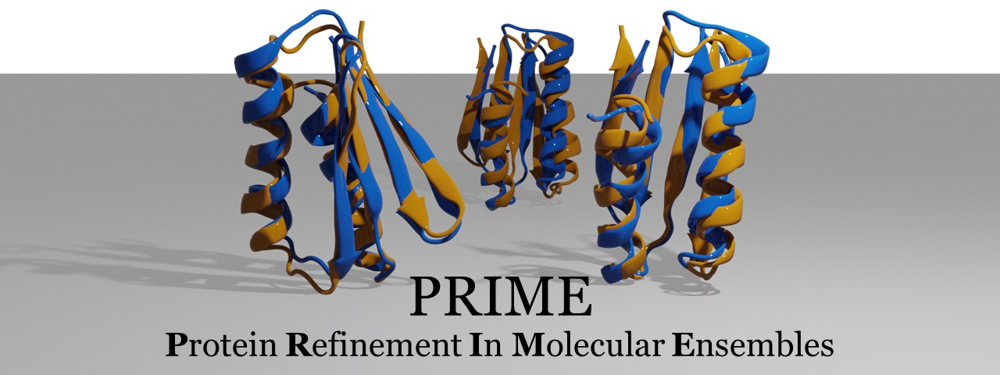

</a>

**🪄 Mastering the art of protein refinement, one conformation at a time 🪄**

Refining protein structures is important because the accuracy of protein structures influence how our understanding of its function and its interactions with other molecules, which can help to design new drugs to target specific molecular interactions.  

This repo contains six different ways of determining the native structure of biomolecules from simulation or clustering data. 

</a>

*Fig 1. Six techniques of protein refinement. Blue is top cluster.* 

### Usage
`modules` contains the functions required to run the algorithm. `new_clusters/clusttraj.c*` contains sample clustering files prepared through CPPTRAJ Hierarchical clustering. `new_clusters/normed_clusttraj.c*` consists clustering files normalized through min-max normalization. `new_clusters/normed_data.txt` contains all clustering files are appended through and normalized. `similarity.py` generates a similarity dictionary from running the protein refinement method. 

### Tutorial

Step 1. 
```
git clone https://github.com/lexin-chen/PRIME.git
```
Step 2. 

- Normalize the trajectory data between $[0,1]$ using the Min-Max Normalization. 

Step 3
```
"""
Keyes are frame #.
Values are [cluster 1 similarity, cluster #2 similarity, 
            ..., average similarity of all clusters]
"""
{f1: [0.1,
      0.2,
      ...
      average],
 f2: [0.2,
      0.3,
      ...
      average],
```
Step 4. Determine the native structure using `scripts/rep.py`.
